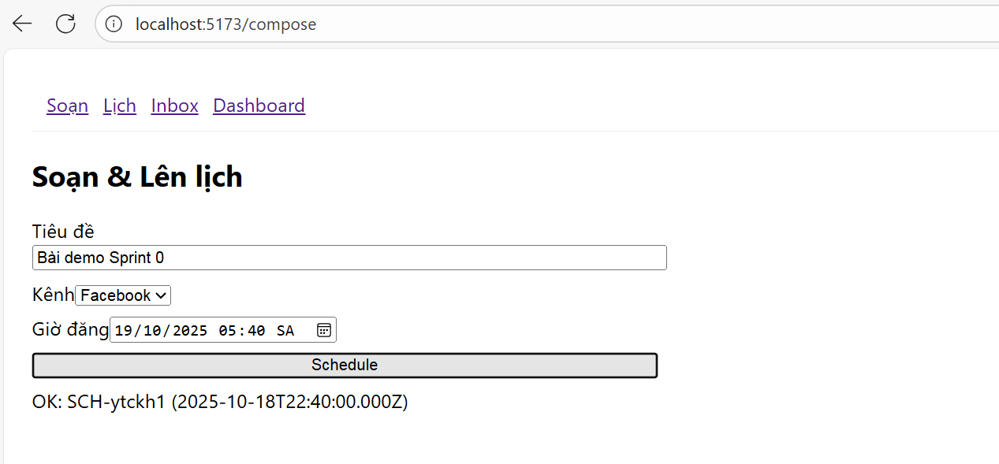
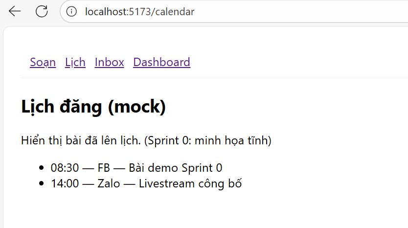
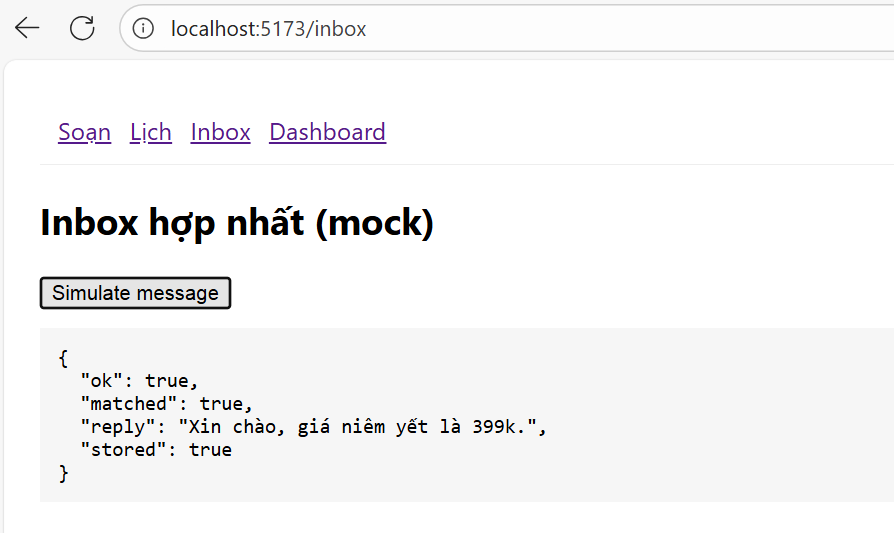
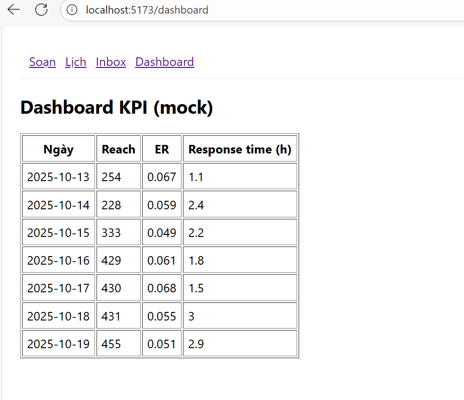
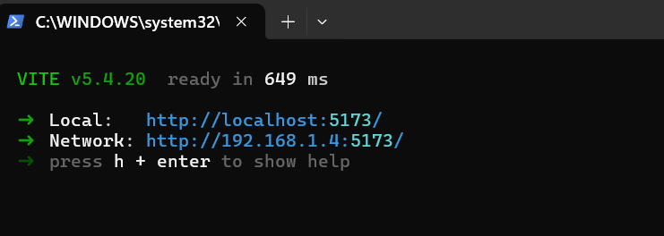
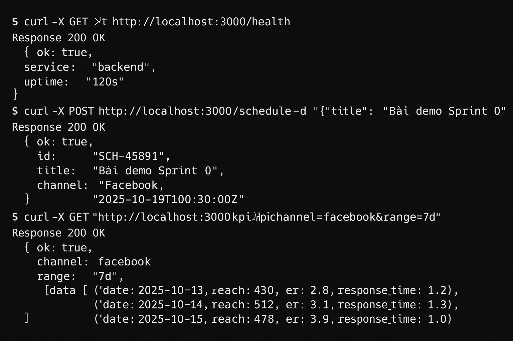
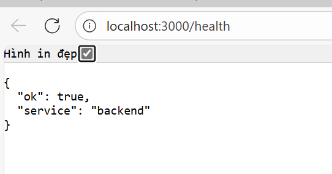
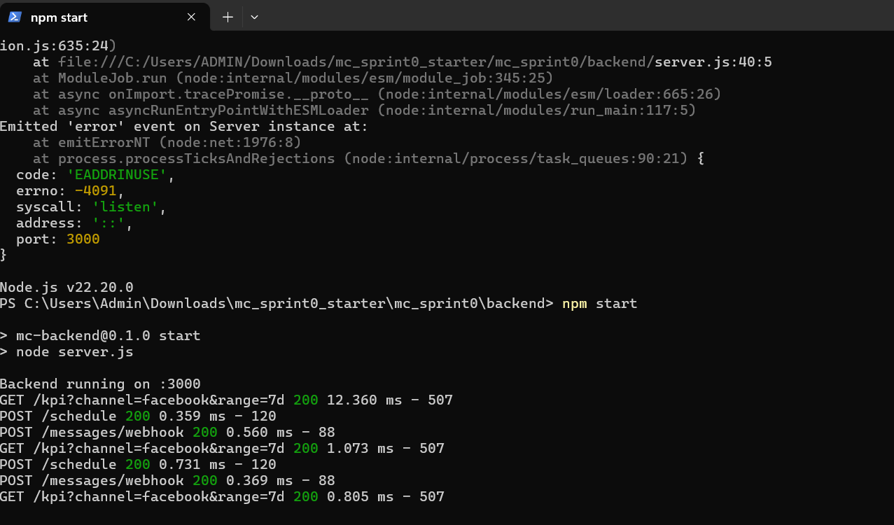

# Web App Truyền thông Đa Kênh — Sprint 0 (Flow Demo)

> Nhóm: **Thùy – Mai – Hân**  
Mục tiêu Sprint 0: có **flow demo chạy được** để trình bày “nội dung đề tài cần thực hiện”.

## 1) Công nghệ
- **Frontend**: Vite + React + Tailwind (4 màn hình: Compose / Calendar / Inbox / Dashboard)
- **Backend**: Node.js + Express (REST + Webhook + Rule Engine)
- **Tài liệu**: Postman collection, sơ đồ (Use Case, Sequence, ERD)
- **DevOps (mô phỏng)**: `docker-compose.yml`, `.env.example` (chưa bật Docker vì cấu hình máy; demo chạy bằng Node.js)

## 2) Cấu trúc thư mục
mc_sprint0/
backend/ # Express API (server.js)
frontend/ # Vite React UI
postman/ # sprint0.postman_collection.json
docs/ # ảnh chụp UI/health/kiến trúc
.env.example # mẫu biến môi trường
README.md
docker-compose.yml (tùy chọn)


## 3) Chạy nhanh (KHÔNG Docker)
> Yêu cầu: Node.js ≥ 18 (đã test v22)

**Cửa sổ 1 – Backend**
```bash
cd backend
npm install
npm start
# Kỳ vọng: "Backend running on :3000"
# Kiểm tra: http://localhost:3000/health  -> {"ok":true,"service":"backend"}

**Cửa sổ 2 – Frontend**

cd frontend
npm install
npm run dev -- --host
# Mở: http://localhost:5173

## 4) Flow demo cần trình bày

Soạn → bấm Schedule → nhận phản hồi id (FE gọi POST /schedule)

Inbox → Simulate message → nhận matched/reply (FE gọi POST /messages/webhook)

Dashboard → hiển thị KPI 7 ngày (FE gọi GET /kpi)

## 5) Endpoint mock (backend)

GET /health → { ok, service }

POST /schedule → { ok, id, title, channel, scheduledAt }

POST /messages/webhook → { ok, matched, reply, stored }

GET /kpi?channel=facebook&range=7d → { ok, data:[{date,reach,er,response_time}] }

## 6) Biến môi trường

Sao chép .env.example thành .env (local, không commit):
# FRONTEND
VITE_API_BASE=http://localhost:3000
# BACKEND
PORT=3000
JWT_SECRET=change-me
FB_PAGE_ACCESS_TOKEN=
FB_VERIFY_TOKEN=
ZALO_OA_ACCESS_TOKEN=
ZALO_APP_SECRET=

## 7) (Tùy chọn) Docker
cp .env.example .env
docker compose up -d --build
# FE: http://localhost:5173 | BE: http://localhost:3000/health

## 8) Lỗi thường gặp

EADDRINUSE :3000: đã có backend chạy → dừng cửa sổ cũ (Ctrl+C, Y) rồi npm start.

Mở 5173 báo từ chối kết nối: bật lại npm run dev -- --host.

Lỡ commit .env: git rm --cached .env && git commit -m "remove .env" && git push.

## 9) Minh chứng nộp thầy (Screenshots)

<table>
  <tr>
    <td><strong>Soạn</strong></td>
    <td><strong>Lịch</strong></td>
  </tr>
  <tr>
    <td></td>
    <td></td>
  </tr>
  <tr>
    <td><strong>Inbox</strong></td>
    <td><strong>Dashboard</strong></td>
  </tr>
  <tr>
    <td></td>
    <td></td>
  </tr>
  <tr>
    <td><strong>Frontend (Trang chính)</strong></td>
    <td><strong>API tổng hợp</strong></td>
  </tr>
  <tr>
    <td></td>
    <td></td>
  </tr>
  <tr>
    <td><strong>Backend /health</strong></td>
    <td><strong>Backend console</strong></td>
  </tr>
  <tr>
    <td></td>
    <td></td>
  </tr>
</table>
