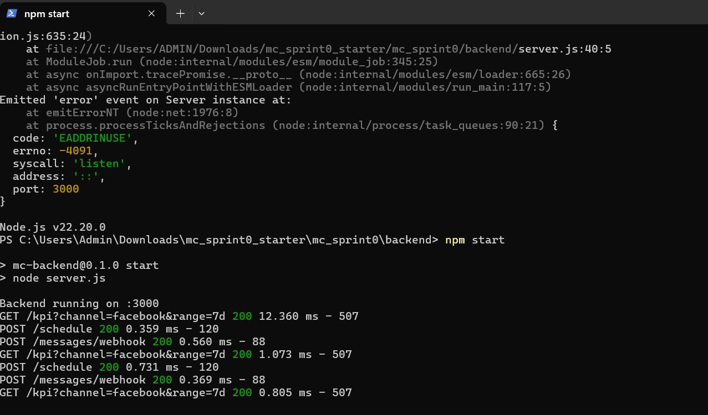

# Cổng Truyền Thông Số Đa Kênh cho **Chuỗi Bakery** — Sprint 0 (Flow Demo)

> Nhóm: **Thùy – Mai – Hân**  
> Mục tiêu Sprint 0: Có **flow demo chạy được** cho bối cảnh **chuỗi Bakery** để trình bày “nội dung đề tài cần thực hiện”.

## 1) Công nghệ
- **Frontend**: Vite + React + Tailwind (4 màn hình: **Đăng bài bánh** / **Lịch đăng** / **Tin nhắn khách** / **Dashboard KPI**)
- **Backend**: Node.js + Express (REST + Webhook + Rule Engine đơn giản)
- **Tài liệu**: Postman collection, sơ đồ (Use Case, Sequence, ERD – *tối thiểu cho sprint 0*)
- **DevOps (mô phỏng)**: `docker-compose.yml`, `.env.example` (chưa bật Docker vì cấu hình máy; demo chạy bằng Node.js)

## 2) Cấu trúc thư mục (rút gọn)
mc_sprint0_bakery/
backend/ # Express API (server.js)
frontend/ # Vite React UI (4 màn hình)
postman/ # sprint0.postman_collection.json
docs/ # ảnh chụp UI/health/kiến trúc (để nộp)
.env.example # mẫu biến môi trường (copy thành .env khi chạy local)
README.md
docker-compose.yml (tùy chọn)

shell
Copy code

## 3) Chạy nhanh (KHÔNG Docker)
> Yêu cầu: Node.js ≥ 18 (đã test v22)

**Cửa sổ 1 – Backend**
```bash
cd backend
npm install
npm start
# Kỳ vọng: "Backend running on :3000"
# Kiểm tra: http://localhost:3000/health  -> {"ok":true,"service":"backend"}
Cửa sổ 2 – Frontend

bash
Copy code
cd frontend
npm install
npm run dev -- --host
# Mở: http://localhost:5173
4) Flow demo cần trình bày (Bakery)
Đăng bài bánh → bấm Schedule → nhận phản hồi id (FE gọi POST /schedule)

Tin nhắn khách → bấm Simulate message → nhận matched/reply (FE gọi POST /messages/webhook)

Dashboard KPI → hiển thị KPI 7 ngày (FE gọi GET /kpi)

5) Endpoint mock (backend)
bash
Copy code
GET    /health                         -> { ok, service }
POST   /schedule                       -> { ok, id, title, channel, scheduledAt }   // title gợi ý: "Ra mắt bánh mới - Croissant bơ"
POST   /messages/webhook               -> { ok, matched, reply, stored }            // reply theo giọng Bakery
GET    /kpi?channel=facebook&range=7d  -> { ok, data:[{date, reach, er, response_time}] }
6) Biến môi trường
Sao chép .env.example thành .env (local, không commit):

env
Copy code
# FRONTEND
VITE_API_BASE=http://localhost:3000

# BACKEND
PORT=3000
JWT_SECRET=change-me
FB_PAGE_ACCESS_TOKEN=
FB_VERIFY_TOKEN=
ZALO_OA_ACCESS_TOKEN=
ZALO_APP_SECRET=
7) (Tùy chọn) Docker
bash
Copy code
cp .env.example .env
docker compose up -d --build
# FE: http://localhost:5173 | BE: http://localhost:3000/health
8) Lỗi thường gặp
EADDRINUSE :3000: đã có backend chạy → dừng cửa sổ cũ (Ctrl + C) rồi npm start.

5173 refuse: bật lại npm run dev -- --host.

Lỡ commit .env:
git rm --cached .env && git commit -m "remove .env" && git push.

9) Minh chứng nộp thầy (Screenshots)


<table> <tr><td><strong>Đăng bài bánh</strong></td><td><strong>Lịch đăng</strong></td></tr> <tr><td></td><td></td></tr> <tr><td><strong>Tin nhắn khách</strong></td><td><strong>Dashboard KPI</strong></td></tr> <tr><td></td><td></td></tr> <tr><td><strong>Frontend (trang chính)</strong></td><td><strong>API tổng hợp</strong></td></tr> <tr><td></td><td></td></tr> <tr><td><strong>Backend /health</strong></td><td><strong>Backend console</strong></td></tr> <tr><td></td><td></td></tr> </table> ```